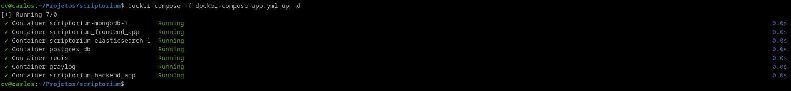
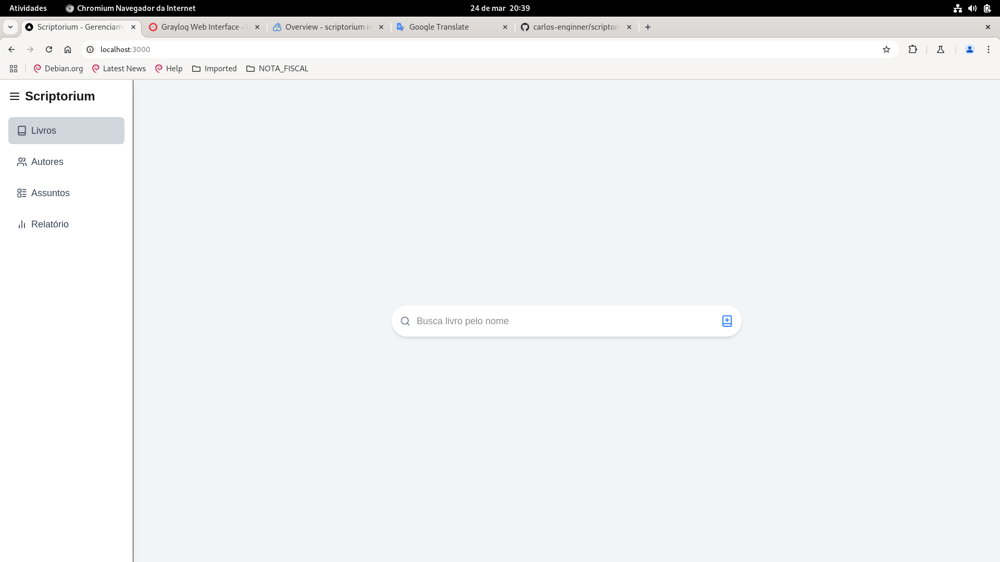
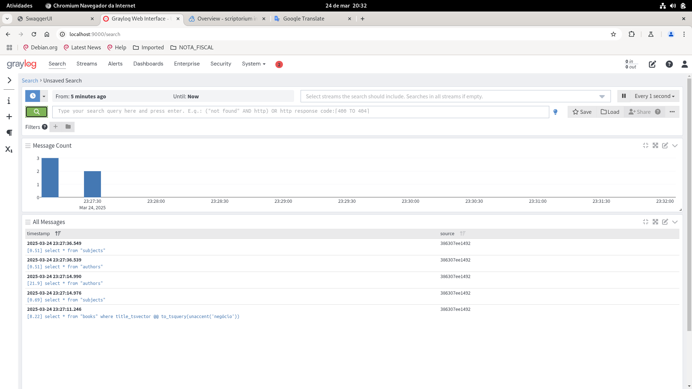
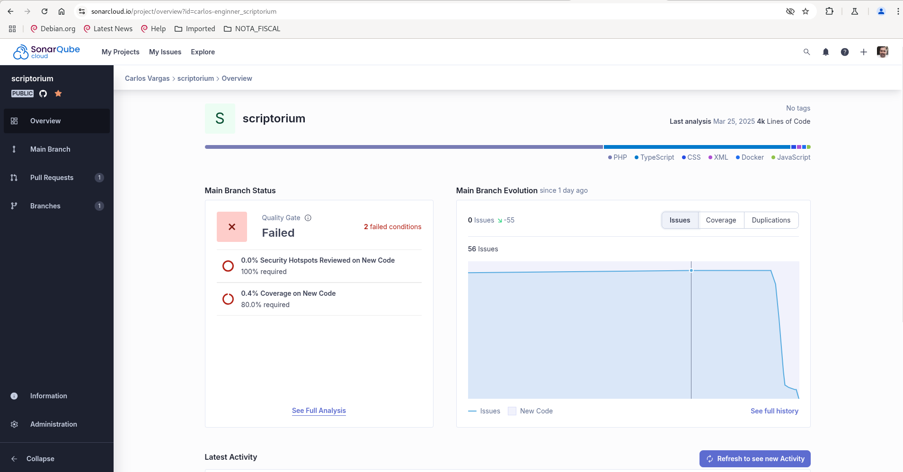
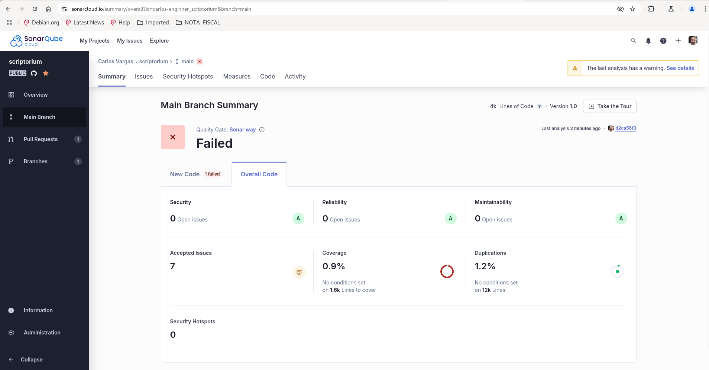

# Scriptorium

Sistema de gestão de livros

---

## 📌 Configurando a aplicação

### 🔄 Baixe o projeto
```sh
git clone https://github.com/carlos-enginner/scriptorium.git
```

### 🛠 Adicione o arquivo `.env` no diretório raiz do projeto baixado

Crie um arquivo `.env` em ./backend e insira as seguintes configurações:

```env
APP_NAME=scriptorium
APP_ENV=dev

DB_DRIVER=pgsql
DB_HOST=db
DB_PORT=5432
DB_DATABASE=scriptorium
DB_USERNAME=scripto
DB_PASSWORD=scripto142536
DB_CHARSET=utf8
DB_COLLATION=utf8_unicode_ci
DB_PREFIX=

REDIS_HOST=cache
REDIS_AUTH=null
REDIS_PORT=6379
REDIS_DB=0

GRAYLOG_IP=graylog
GRAYLOG_STREAM_ID=app.scriptorium
GRAYLOG_TCP_PORT=12201
GRAYLOG_UDP_PORT=12201
```

---

## 🚀 Subindo a aplicação

Para iniciar os containers da aplicação, execute:

```sh
docker-compose -f docker-compose-app.yml build --no-cache
docker-compose -f docker-compose-app.yml up -d --remove-orphans
```



---

## 🌐 Acessando a aplicação

### 📄 Aplicativo

Acesse a aplicação pelo navegador:

🔗 **[http://localhost:3000/](http://localhost:3000/)**

> ⚠️ **Nota:** O primeiro carregamento pode ser mais lento, pois o ambiente está configurado no modo **dev**.



### 📖 Documentação da API (Swagger)

A API possui documentação interativa com Swagger:

🔗 **[http://localhost:9500/docs](http://localhost:9500/docs)**


---

## 📊 Monitoramento da aplicação

### 🔍 Graylog

Para acessar os logs da aplicação no **Graylog**:

🔗 **[http://localhost:9000/streams/](http://localhost:9000/streams/)**

- Clique em **app.scriptorium**
- **Login:** `admin`
- **Senha:** `142536`



### 📈 SonarQube

Para acessar a análise de qualidade do código no **SonarQube**:

🔗 **[SonarCloud](https://sonarcloud.io/organizations/carlos-vargas/projects)**




---

## ✅ Boas práticas no backend

- ✅ Cobertura de código
- ✅ Análise estática
- ✅ Code compliance
- ✅ Testes unitários
- ✅ Testes de integração
- ✅ Observabilidade com GELF
- ✅ CI/CD via **[GitHub Actions](https://github.com/carlos-enginner/scriptorium/actions)** e Quality Gate integrado com SonarQube Cloud.
- ✅ Documentação da API com Swagger

---

## 🛠 Stacks utilizadas

### 🖥 **Frontend**
- Next.js / React

### 🔧 **Backend**
- PHP 8.1
- Hyperf v3
- Swoole
- PHPUnit 10.5

### 🗄 **Banco de Dados e Cache**
- PostgreSQL 15
- Redis

### 📦 **Infraestrutura**
- Docker 28.0.2
- Docker Compose 2.29

### 📊 **Monitoramento e Qualidade**
- Graylog
- SonarQube Cloud
- Swagger

---

## 🔜 O que ficou faltando?

- ✅ Instrumentalização da aplicação com OpenTelemetry e Grafana;
- ✅ Melhorar a identidade visual da interface web;
- ✅ Criação do relatório (embora ainda não tenha sido implementada, outros recursos foram ativados, evidenciando minha competência em aspectos de baixo nível, como o uso do ts_vector para full text search, triggers e etc...).
- ✅ Ampliar a cobertura dos códigos para backend
- ✅ Criação da estrutura de testes unitários no frontend;
- ✅ Aplicar testes E2E com Cypress;

## 📹 Demonstração

Assista à demonstração completa clicando no link abaixo:

[Demonstração do Projeto](https://www.loom.com/share/a5128c375e0043a1a9707e1a463417e9)
